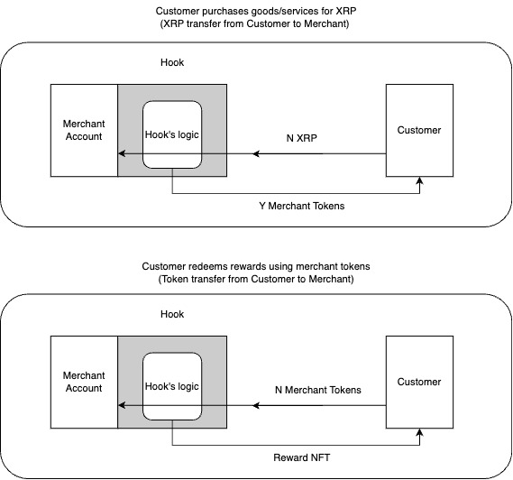

# Loyalty Program Platfrom on [XRPL](https://xrpl.org/)

## About
This project is a submission for XRPL Campus Ambassador Program.

A live version of the project can be found at [link](https://loyalty-platform-xrpl.vercel.app/)

Created by [Vadzim Mahilny]()

## Table of Contents
- [Project Idea](#project-idea)
- [Loyalty programs for SMEs (Small and Medium Enterprises)](#loyalty-programs-for-smes-small-and-medium-enterprises)
- [Preview](#preview)
- [Documentation](#documentation)
    - [Project Spec](#project-spec)
    - [Diagrams](#diagrams)
    - [Hooks](#hooks)
- [Installation](#installation)

<a id="project-idea"></a>
## Project Idea
**Brief description: The core idea is to digitalize loyalty programs to make them more convenient and sustainable for both businesses and consumers. My platform will provide merchants with quick and easy way to create and customize their loyalty programs. Customers on the other hand will be provided with dashboard where they can view their spending, loyalty points earned, as well as redeem this loyalty points. For example, a coffee shop can set up a program such as for every 1$ spent customer receives a token that is associated with this coffee shop. Customer then can redeem this tokens on the platform to get goods/services.**

**Main objectives:**

1. Improve service quality for clients, by providing them with convenient digital platform for tracking and redeeming rewards.
2. Increase retention rates for small/medium businesses by giving them an easy way to set up and customize their loyalty program.
3. Leverage XRPL to provide secure, fast and sustainable service (no more paper cards to track rewards).

<a id="loyalty-programs-for-smes-small-and-medium-enterprises"></a>
## Loyalty programs for SMEs (Small and Medium Enterprises)
**Loyalty programs are a great way to increase customer retention rates. However, they are not widely used by small and medium businesses. The main reason for this is that it is hard to set up and maintain a loyalty program.**

**Ripple article about ["How Can Crypto Evolve Brand Rewards and Loyalty?](https://ripple.com/insights/how-can-crypto-evolve-brand-rewards-and-loyalty/?utm_campaign=&utm_medium=organic_social&utm_source=linkedin)**

<a id="preview"></a>
## Preview
#### Main Page

#### Business Dashboard

#### Business Settings

#### Business rewards

#### Business create reward


#### Customer Dashboard

#### Customer Store List

#### Customer Store Rewards


<a id="documentation"></a>
## Documentation
<a id="project-spec"></a>
### Project Spec
The project is built using:
- [React](https://reactjs.org/)
- [Groomet JS](https://v2.grommet.io/)
- [Next JS](https://nextjs.org/)
- [Supabase](https://supabase.io/)
- [XRPL](https://xrpl.org/)


<a id="diagrams"></a>
### User Flow Diagrams
#### Customer Flow


#### Merchant Flow


<a id="hooks"></a>
#### Hooks
During account set up process merchant sets the `loyaltyHook` onto their XRPL account. Hook is set with two parameters provided by merchant `token symbol` (3 characters) and `token ratio` (amount of tokens that is sent to customer depending on the amount of XRP they sent to merchant).


<a id="installation"></a>
## Installation
Run locally or visit deployed version at [link]()
1. Clone the repo
```git clone https://github.com/MIDAV0/loyalty-platform-xrpl.git```
2. Install packages
```yarn install```
3. Create .env file in the root directory and add the following variables
```
CLIENT="wss://s.altnet.rippletest.net:51233/"
EXPLORER_NETWORK="testnet"
DATABASE_URL="supabase_url"
HOOK_NAME="loyaltyHook"
```
4. Run the server locally
```yarn dev```